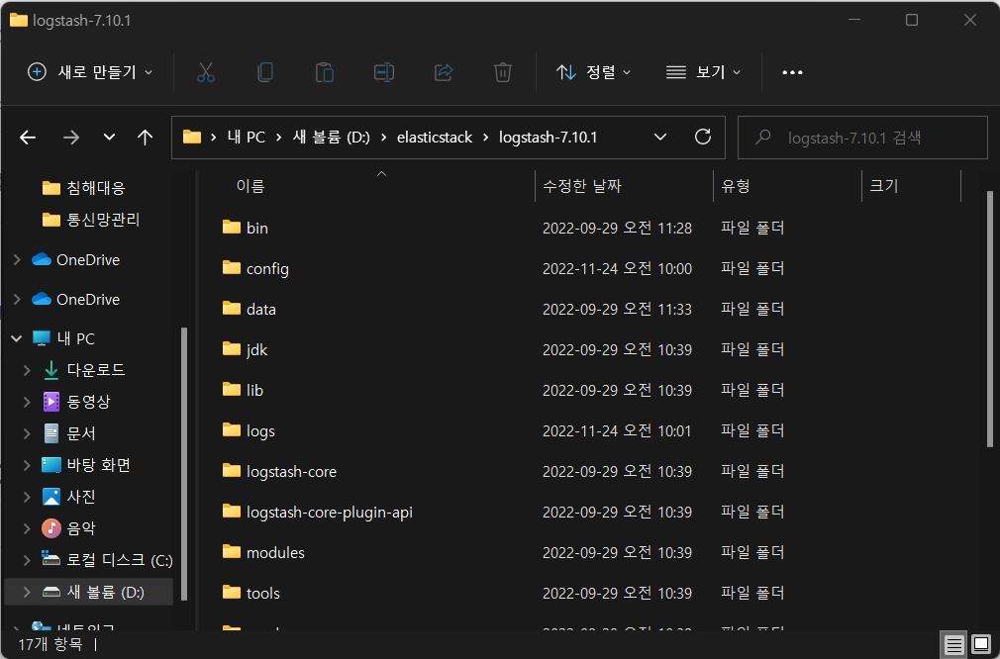

# ElasticSearch Twitter logging 
 

## Step1
 
엘라스틱서치 폴더에 들어가서 bin\elasticsearch.bat 파일을 실행한다. 
 
위 그림은 실행 장면이다.
 

## Step2
 
엘라스틱서치가 완전히 실행되면 키바나 폴더에서 bin\kibana.bat 파일을 실행한다. 
 
위 그림은 실행장면이다.
 

## Step3
 
키바나가 완전히 실행되면 logstash파일에 들어가서 이번에는 실행하는 것이 아닌 경로부분에 cmd를 입력하여 커맨드 창을 실행한다. 
 
커맨드창을 실행 후 bin\logstash.bat =f config\logstash-twitter.conf 명령어를 입력한다. 
 
위 그림은 명령어를 입력한 후 실행장면이다.
 

## Step4
 
미리 준비한 tweetlog > 가상환경 폴더이다. 가상환경 폴더에서 logstash처럼 경로 부분에 cmd를 입력하여 커맨드 창을 실행한다. 
 
커맨드창을 실행후 Scripts\activate 명령어를 입력하여 가상화 모드에 진입한다. 
 
위 그림은 가상화 모드에 진입한 상황이다. 
 
가상화모드에 python이 설치되어 있는지 확인하기 위해 python 명령어를 입력하여 확인한다. (확인 후 나가는 명령어는 quit()이다.) 
 
가상화 모드에 pip install tweepy를 입력하여 설치를 진행한다. 
 
가상화 모드에 pip install python-logstash를 입력하여 설치를 진행한다.  

## Step5
 
위 py파일은 트위터를 로깅하기위해 준비한 파일이다. 인터넷에 올릴때는 외부인이 악용할 우려가 있는 토큰은 꼭 가려주도록 한다. 
 
아까 준비해둔 가상화 환경에서 python tweepy2.py 명령어를 입력하여 파일을 실행한다. (py파일은 가상화 폴더 안에 같이 있는 것이 실행하기에 편하다.) 
 
아까 키바나에서 bin\logstash.bat =f config\logstash-twitter.conf 명령어를 실행했던 화면에 트위터가 로깅되는 것을 확인 할 수 있다. 
충분한 시간동안 로그를 수집하면된다. 

## Step6
 
엘라스틱 서치 홈페이지에 접속을한다.(http://localhost:9200/) 
접속후에 엘라스틱 왼쪽상단에 있는 메뉴바를 눌러 맨밑에 Stack Management에 진입한다. 
 
Stack Management에 진입 후 좌측 Index Patterns를 누르고 우측 상단Create index pattern을 누른다. 
 
Create index pattern을 진행한 후에 index pattern name 아래에 미리 py 파일에서 설정한 이름을 검색후에 Next step을 눌러 진행한다. 
 
좌측 상단 메뉴바를 눌러 Discover에 들어간 후 좌측에서 설정한 이름을 선택한 후에 우측 상단 트위터 로그를 수집한 시간을 설정한다. 그러면 각 시간마다. 트위터 로그가 수집된 내역과 시간별 수집된 로그양을 보여준다. 

위 처럼 어렵지 않게 트위터 로그를 수집할 수 있다.
